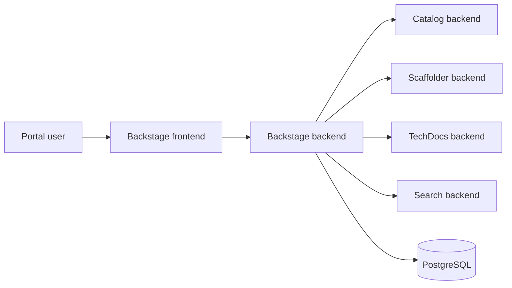

# Developer Portal

This site documents the `developer-portal` System: the Backstage application that owns the software catalog, scaffolder, TechDocs backend, search, and the runtime configuration used by the local KinD deployment.

## System Boundary

The System entity represents the portal as a product surface. The implementation lives in the `backstage/` workspace, while the deployable Kubernetes workload is rendered from `charts/backstage/` and receives environment-specific values from `deploy/dev/backstage.yaml`.

The root catalog entity for this System points at `backstage/` as its source location. The Component, API, and database Resource that make up the running application are described in `backstage/catalog-info.yaml` and are discovered through the same GitHub catalog ingestion path as the rest of the repo.

## Operator Responsibilities

Platform operators should treat the portal as a normal Backstage deployment with repo-local defaults and KinD-specific runtime overrides:

- Application defaults live in `backstage/app-config.yaml`.
- Local development overrides live in `backstage/app-config.local.yaml`.
- Production image runtime config is supplied by the Helm chart through a mounted ConfigMap.
- The GitHub token is supplied by the `backstage-github-token` Secret rather than committed configuration.
- The PostgreSQL password for KinD is generated or supplied through the chart values path.

The portal currently favors a simple local development model. TechDocs builds run inside the Backstage pod, docs output is cached on the pod filesystem, and the catalog discovers entities from the GitHub repository URL rather than from a cluster-local checkout.
