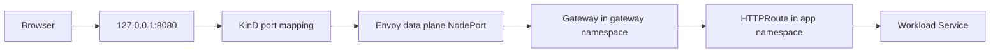

# Edge Gateway

This site documents the `edge` System: the Envoy Gateway entry point used by the local KinD platform. The `charts/edge-gateway` Helm chart owns the shared Gateway resource, while workload charts attach their own `HTTPRoute` resources from application namespaces.

## Architecture

Terraform installs the Gateway API CRDs, the Envoy Gateway controller, and a custom `GatewayClass` named `eg-nodeport`. This chart then creates a `Gateway` that binds to that class and listens for HTTP traffic on hostnames matching `*.localtest.me`.

The local URL shape depends on `localtest.me`, which resolves subdomains to `127.0.0.1`. That lets each workload use a real hostname, such as `backstage.localtest.me`, without editing `/etc/hosts`.

## Chart Contract

The chart renders one Gateway resource:

- `gatewayClassName` defaults to `eg-nodeport`.
- `hostname` defaults to `"*.localtest.me"`.
- The HTTP listener is named `http`, uses port `80`, and accepts only routes from opted-in namespaces.
- The `allowedRoutes` selector defaults to `gateway-routes=enabled`.

The chart does not create application `HTTPRoute` resources. Workload charts own their own routes and point their `parentRefs` at this shared Gateway. The Backstage chart is the current example: it creates an `HTTPRoute` for `backstage.localtest.me` and references the Gateway in the `gateway` namespace.

## Operational Boundary

The edge System is shared infrastructure. It admits routes, but it does not decide which services exist, which paths a workload exposes, or how a workload rolls out. Application charts remain responsible for their own Deployments, Services, and `HTTPRoute` rules.

Changing this chart affects every workload that attaches to the Gateway. Treat updates to `gatewayClassName`, listener hostnames, ports, or `allowedRoutes` as platform changes, not per-application tweaks.
