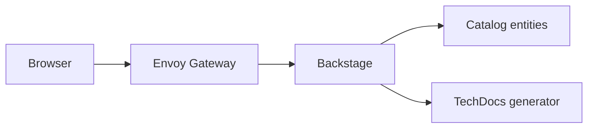

# Platform

This site is the TechDocs entry point for the `platform` Domain. It collects repo-wide context for the local Backstage environment, the Kubernetes development stack, and the architectural decisions that shape both.

## Runtime Shape

The local platform is built around a KinD cluster provisioned by Terraform. Envoy Gateway exposes Backstage through the Gateway API at `backstage.localtest.me`, while Helm owns the Backstage workload and the reusable edge Gateway resources.

## Documentation Model

TechDocs sites live next to the catalog entities they describe. The platform Domain owns this root site, and other Systems or Templates can add their own `mkdocs.yaml` and `docs/` directory without changing the lint target.

Use the ADR pages for durable decisions:

- [ADR-0001: KinD + Terraform + Envoy Gateway](adr/0001-kind-terraform-envoy-gateway.md)
- [ADR-0002: Helm Chart Architecture](adr/0002-helm-chart-architecture.md)

Use the operator guides for setup tasks:

- [GitHub App Setup](operator/github-app-setup.md)

## Operational Notes

The Backstage pod builds TechDocs locally on first request using the mkdocs tooling bundled into the Backstage image. Generated output is published to the pod filesystem, so a pod restart clears the cache and the next reader pays the build cost again.
